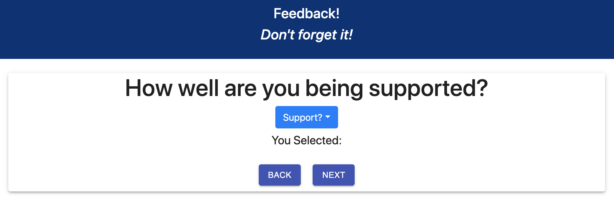
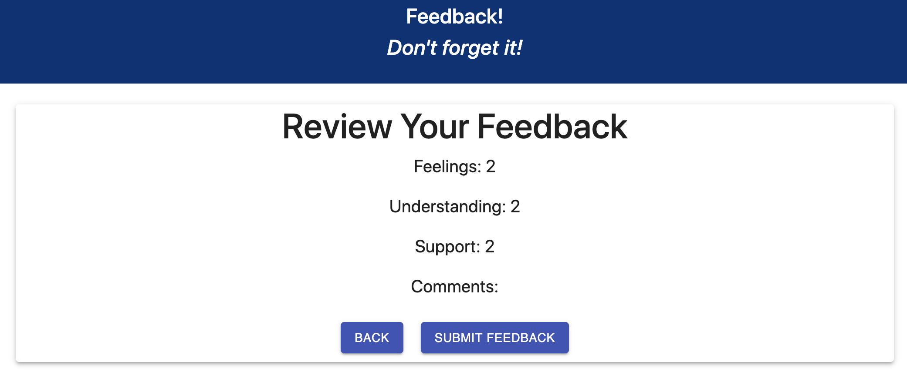
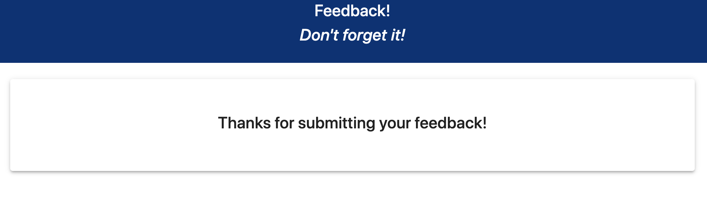

# Feedback App
## Description
_Duration:_ Weekend project
This a feedback app, where a user can answer a few questions on a scale of 1 to 5.

In building this app, I practiced skills for full stack integration, connecting a react/redux-powered front end through a node server to a SQL database.

## Screenshots

## Prerequisites 
To run this app you will need:
- React
- Node.js
- PostGreSQL

## Install
To run this application:
- create a database in postgres called `prime_feedback`
- Execute the SQL commands from `database.sql`
- Run `npm install` from the project root directory
- Run `npm run server` to run the node server
- Run `npm run client` to run the client server
- Open `http://localhost:3000` in your server

## Usage
Answer a question and then click next to proceed to the next page.
Click back to change a previous answer
